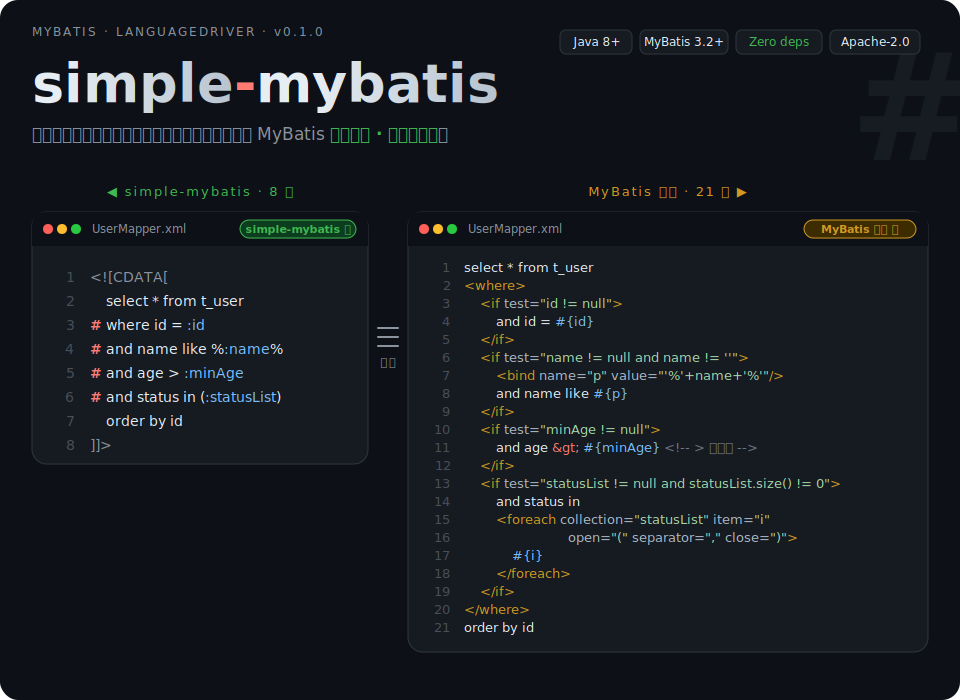
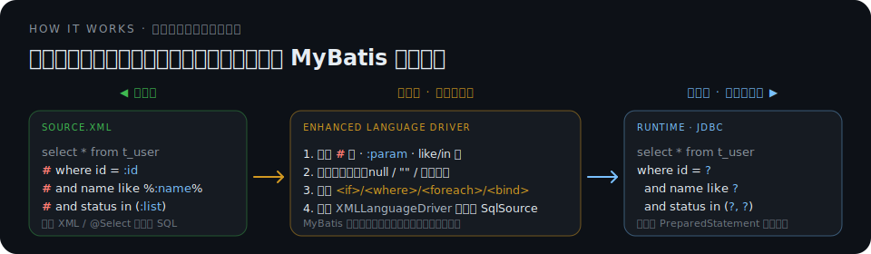

<p align="center">
  
</p>

<p align="center">
  <b>MyBatis LanguageDriver 增强插件</b> ·
  <a href="#30-秒上手">30 秒上手</a> ·
  <a href="#语法速览">语法速览</a> ·
  <a href="#工作原理">工作原理</a> ·
  <a href="syntax-guide.md">详细语法</a>
</p>

---

## 30 秒上手

**1. 加依赖**

```xml
<dependency>
  <groupId>io.github.luo-zhan</groupId>
  <artifactId>simple-mybatis</artifactId>
  <version>0.1.0</version>
</dependency>
```

**2. 一行配置全局启用**（存量 SQL 完全兼容，不改一行也能运行）

```xml
<!-- mybatis-config.xml -->
<settings>
  <setting name="defaultScriptingLanguage"
           value="io.github.luozhan.simplemybatis.EnhancedLanguageDriver"/>
</settings>
```

**3. 开始写**

```xml
<select id="findUsers" resultType="User"><![CDATA[
  select * from t_user
  # where id = :id
  # and name like %:name%
  # and status in (:statusList)
  order by id
]]></select>
```

参数为空的行自动省略；集合、字符串、null 一起判空；`#` 在 DMS 里天然是注释——**粘进数据库工具直接可跑**。

---

## 为什么值得用

| 痛点 | 原生 MyBatis                      | simple-mybatis              |
|---|---------------------------------|-----------------------------|
| 动态条件 | `<if test="...">` 3行            | `# and col = :col`，一行       |
| LIKE 模糊 | `<bind>` + `<if>` 4行            | `like %:name%`一行            |
| IN 集合 | `<foreach>` 5行                  | `in (:list)` 一行             |
| UPDATE SET | `<set>` + `<if>`                | `#set col = :val,`一行        |
| 自定义条件 | `<if test="a != null and a > 0">` | `#(a != null && a > 0)`     |
| XML 转义 | `<` `>` `&` 逐个转义                | CDATA 全包裹，**零转义**           |
| DB 工具调试 | 挨个删标签、改参数                       | 直接拷贝，`#` 行自动变注释             |
| 运行时性能 | 原生                              | **完全一致**（启动期翻译）             |
| 第三方依赖 | —                               | **零**（仅 MyBatis `provided`） |

---

## 语法速览

> 每一段增强语法都能被启动期翻译成等价的原生 MyBatis 结构

### `#` — 动态条件（替代 `<if>`/`<where>`）

`#` 从行首标记到行尾，参数为空则自动隐藏

<table>
<tr>
<td width="46%" valign="top">

**simple-mybatis** 🚀

```sql
select * from t_user
# where id = :id
# and name = :name
# and status in (:statusList)
```

- 参数为空自动省略整行
- 自动区分 null / 空串 / 空集合
- `#where` 展开为 `<where>`，首个条件的 `and`/`or` 自动删除

</td>
<td width="54%" valign="top">

**原生 MyBatis** 🐢

```xml
<where>
  <if test="id != null">
    and id = #{id}
  </if>
  <if test="name != null and name != ''">
    and name = #{name}
  </if>
  <if test="statusList != null
            and statusList.size() > 0">
    and status in
    <foreach collection="statusList" item="i"
             open="(" separator="," close=")">
      #{i}
    </foreach>
  </if>
</where>
```

</td>
</tr>
</table>

### `:param` — 占位符简写

`:name` 等价于 `#{name}`，更简洁（不推荐使用mybatis的`${name}`，存在SQL注入风险）。

### `like %:x%` — 通配符自动包装

支持 `%:x%` / `:x%` / `%:x` 三种形式，启动期自动展开为 `<bind>` + `like #{...}`，跨数据库安全。

```sql
# and name like %:name%    →  <bind> + like #{namePattern}
# and code like :code%
# and tail like %:tail
```

### `in (:list)` — 集合自动展开

```sql
# and status in (:statusList)
```

启动期翻译为 `<foreach>`，`null` 或空集合时整个 IN 条件被移除。

### `#(expr) ...` — 自定义 OGNL 条件

默认判空覆盖 95% 场景；需要自定义时用括号包裹 OGNL 表达式，等价 `<if test="...">`。

```sql
select * from t_user
#(id != null && id > 0) where id = :id
#(type == 'a') and name like %:name%
#(type == 'b') and status = :status
```

### CDATA 全包裹 — 告别 XML 转义

原生 MyBatis 里 `<if>` 一旦放进 CDATA 就变成文本；增强语法可以把整段 SQL 用 CDATA 包起来，`<` / `>` / `&` 都不用管。

```xml
<select id="find" resultType="User"><![CDATA[
  select * from t_user
  where age > 10
  # and type > :type
]]></select>
```

---

## 工作原理

<p align="center">
  
</p>

- **只在启动期跑一次** — MyBatis 初始化 Mapper 时，`EnhancedLanguageDriver` 将增强语法翻译成标准 `<if>`/`<where>`/`<set>`/`<foreach>`/`<bind>` + `#{}`。翻译结果作为 `SqlSource` 缓存。
- **运行期是纯原生 MyBatis** — 参数绑定、SQL 组装、PreparedStatement 生成全部走 `XMLLanguageDriver`，与手写 XML 完全一致。**没有反射热路径，没有额外 AST 解析。**
- **原生语法是超集** — 你的存量 SQL 可以不改一行直接运行；也可以在同一条 SQL 内混用（不推荐）。
- **可扩展** — 通过 `Directive` SPI + `ServiceLoader`，可以注册自定义 `#xxx` 语法。

---

## 兼容性 & 逃生舱

| 项 | 值 |
|---|---|
| Java | 8+ |
| MyBatis | 3.2.0 ~ 3.5.x（实测 3.5.x，建议 3.4.6+） |
| 第三方依赖 | 无（仅 MyBatis，`provided`） |
| 入口 | XML Mapper · `@Select` / `@Update` / `@Insert` / `@Delete` 注解 |
| 关闭增强 | 单条 SQL 上用 `lang` / `@Lang` 强制走原生解析 |

极少数场景想跳过增强解析（例如 PostgreSQL 特有语法 `col::int` 与 `#(expr)` 冲突），用 MyBatis 官方能力即可：

```xml
<select id="rawSql" lang="org.apache.ibatis.scripting.xmltags.XMLLanguageDriver">
  select * from t_user where col::int = #{value}
</select>
```

```java
@Lang(XMLLanguageDriver.class)
@Select("select * from t_user where col::int = #{value}")
User rawSql(Integer value);
```

---

## 更多

- **完整语法手册**：[syntax-guide.md](syntax-guide.md) — 所有语法糖、最佳实践、注解 vs XML、边界行为
- **反馈 / 建议**：欢迎在 [GitHub Issues](https://github.com/luo-zhan/simple-mybatis/issues) 提出

## License

[Apache License 2.0](LICENSE)
